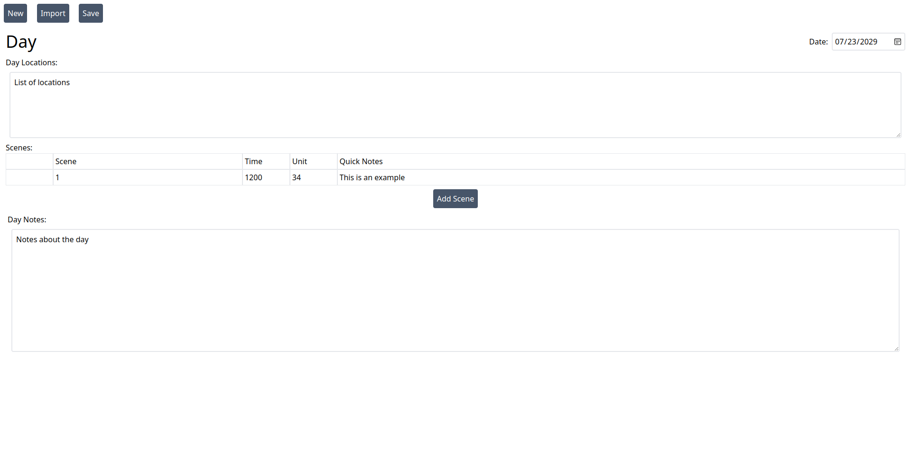
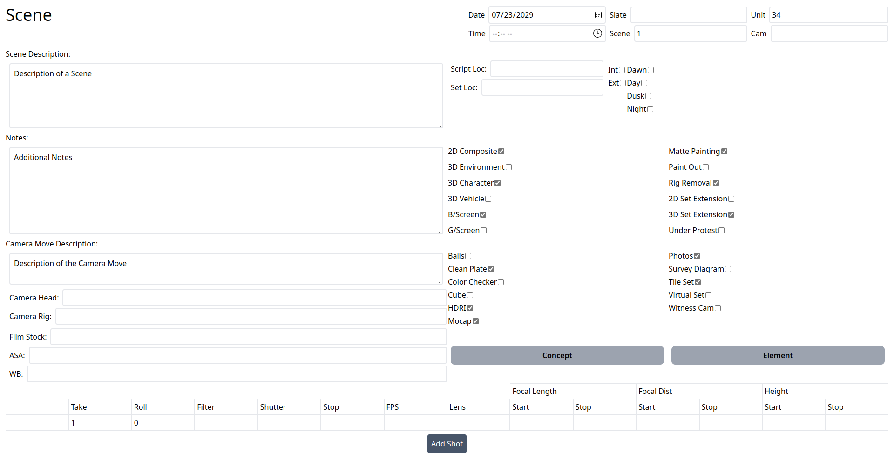
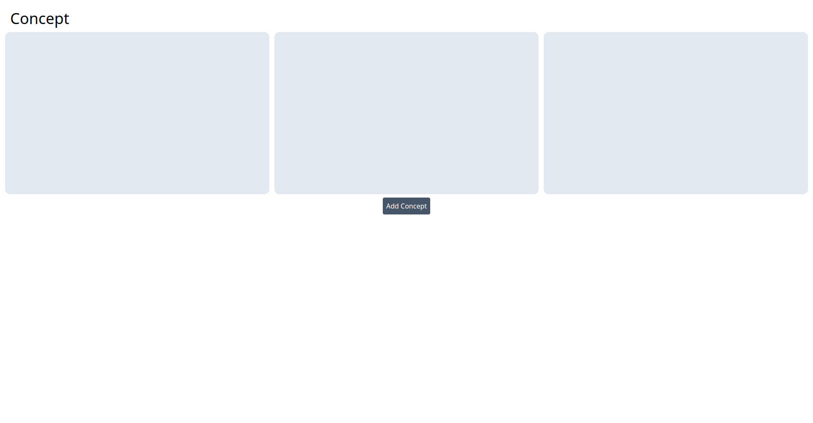

# My Resume

This is my resume in website form.

## Access Control and Authentication

To protect private information, the website redacts Name, address, etc. for visitors without a special link. These special links can be generated at `resume.xympf.net/generate` using the secret key set in the environment variables. The link format is as follows: `<domain>/<token>`. The server verifies the token, displaying either redacted or full information based on its validity.

## Dynamic Content

The animated Image of [Xympf.net](https://xympf.net) is using CSS and Typescript to create a tilt effect which dynamically follows the cursor.
The sidebar is automatically adjusted to be part of the site or open/closeable depending on the size of the screen.

## Projects

These are projects showcased with this site along with a short description. For a more detailed showcase of these projects visit [resume.xympf.net](https://resume.xympf.net)

- Xympf.net:
  - Description: Collaborative Task Organizer Built with Django and React.
  - Demo:<details><summary>Click to expand/collapse</summary>
      
    </details>

- Vfxreport.xympf.net:
  - Description: A structured note taking and report creation utility for Visual Effects Supervisers.
  - Screenshots:<details><summary>Click to expand/collapse</summary>
      
      
      
    </details>

- Pong:
  - Description: An AI powered Discord bot.
  - Repository: [repo](https://github.com/moonymax/pong)

- Pyhook:
  - Description: Python Event hooks and compatibility layer for spigot minecraft server.
  - Repository: [repo](https://github.com/moonymax/pyhook)

- Resume.xympf.net:
  - Description: This website (My Resume)
  - Repository: [repo](https://github.com/moonymax/resume)

## Installation and Usage

To run the webserver locally, follow these steps:

1. Clone the repository.
2. Install the necessary dependencies using npm. This step can be skipped when using docker.
3. Set up the required environment variables, including the secret key for link generation.<br>
```
# The secret has to be used to generate links at <domain>/generate.
VITE_SECRET="" # This is the secret 64 bytes hex string for token verification.
VITE_NAME="" # This is the first and last name
VITE_PHONE="" # This is the phone number
VITE_EMAIL="" # This is the email address
VITE_ADDRESS="" # This is the full address
VITE_ED_1="" # This a school
VITE_ED_2="" # This a school
VITE_ED_3="" # This a school
VITE_ED_4="" # This a school
VITE_DOMAIN="" # This is the domain the website will run under
PORT="" # This is the port the docker container will expose
```
4. Run the webserver using `docker compose up`.

Create a full access link at `<domain>/generate` to view the full information on the website.

## Technologies and Language

The webserver is built using the following technologies and language:

- Typescript
- SolidStart/SolidJS
- TailwindCSS
- JWT
